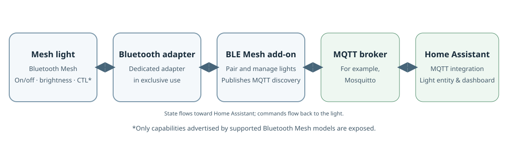

# Bluetooth Mesh to MQTT

<p align="center">
  
</p>

<p align="center">
  <a href="https://github.com/nitrokart/homeassistant-blemesh2mqtt/actions/workflows/ci.yml"></a>
  <a href="https://github.com/nitrokart/homeassistant-blemesh2mqtt/releases"></a>
  
  
  
  <a href="https://github.com/nitrokart/homeassistant-blemesh2mqtt/blob/master/blemesh2mqtt/CHANGELOG.md"></a>
  <a href="https://my.home-assistant.io/redirect/supervisor_add_addon_repository/?repository_url=https%3A%2F%2Fgithub.com%2Fnitrokart%2Fhomeassistant-blemesh2mqtt"></a>
</p>

<p align="center">
  <strong>Local Bluetooth Mesh lighting bridge for Home Assistant via MQTT discovery.</strong><br>
  Pair, control, diagnose, and visualize your mesh network entirely locally — <strong>100% offline, zero vendor clouds, and no proprietary phone apps required.</strong>
</p>

---



---

## ✨ Features

- 💡 **Local Lighting Control:** Native Home Assistant discovery for on/off, smooth brightness dimming, and tunable color temperature (Kelvin / Mireds).
- 🎛️ **Zigbee2MQTT-Style Web Panel:** Clean, tabbed Ingress interface built for both everyday smart home users and engineers:
  - **Devices Dashboard:** Tactile on/off toggles, responsive brightness/temp sliders, and inline pencil rename.
  - **Engineer Inspector ("Tech Specs"):** Slide-out drawer with confirmed round-trip time (RTT), measured hop distances, default TTL, network transmit parameters, and raw JSON telemetry.
  - **Interactive Mesh Topology Map:** Dynamic SVG network graph visualizing direct (1-hop) and multi-hop paths, with rotating halos for active mesh relay repeaters.
  - **Pairing Wizard:** Guided 3-step provisioning flow with radar scan animation and live 4-bar RSSI signal strength meters (dBm).
  - **Live Gateway Logs:** Streaming console with real-time text & regex search, level filters (`Error`, `Warn`, `Info`), and one-click clipboard copy.
- 🔁 **Mesh Relay Management:** Turn mains-powered bulbs and drivers into mesh repeaters to extend network coverage across your home.
- 🍓 **Raspberry Pi 4 Support:** Includes a custom-built BlueZ 5.87 daemon patched for Broadcom onboard Bluetooth controllers via the `generic` I/O backend.
- 💾 **Persistent & Backup Safe:** All mesh network keys and provisioning data are stored in `/data` and survive container rebuilds and Home Assistant backups.

---

## 🚀 Quick Start

### Prerequisites

1. **Home Assistant OS or Supervised** (installs as an add-on).
2. **An MQTT Broker** (e.g. the official Mosquitto broker add-on) and the **MQTT Integration** enabled in Home Assistant.
3. **Dedicated Bluetooth Adapter:** The add-on takes exclusive low-level control of its Bluetooth HCI adapter. Do not share this adapter with Home Assistant's built-in Bluetooth integration.

### Installation

1. Click the button below to add this repository to your Home Assistant Add-on Store:
   
   [](https://my.home-assistant.io/redirect/supervisor_add_addon_repository/?repository_url=https%3A%2F%2Fgithub.com%2Fnitrokart%2Fhomeassistant-blemesh2mqtt)
   
   *Or manually navigate to:* **Settings → Add-ons → Add-on Store → ⋮ (top right) → Repositories**, and add:
   ```
   https://github.com/nitrokart/homeassistant-blemesh2mqtt
   ```

2. Find **Bluetooth Mesh to MQTT** in the store and click **Install**.
3. **Configuration:**
   - If using a **Raspberry Pi 4 onboard Bluetooth controller**, navigate to the add-on's **Configuration** tab and set:
     ```yaml
     io: generic
     ```
   - If using a USB Bluetooth dongle, ensure `adapter` matches its HCI index (e.g. `0` for `hci0`).
4. **Start the add-on** and click **Open Web UI** (or select **BLE Mesh** from the left sidebar).

> ⏳ **Note:** The first install builds the BlueZ mesh daemon from source and may take 10–20 minutes on a Raspberry Pi.

---

## 💡 Pairing Your First Light

1. **Put the light in pairing mode:** Turn the physical power switch **OFF and ON 3 to 5 times** until the light starts blinking or pulsing rapidly (refer to your bulb's user manual).
2. Keep the light powered and within 2–3 meters of the Home Assistant host during pairing.
3. Open the **BLE Mesh** panel, switch to the **Add Device** tab, and click **Start Discovery Scan (10s)**.
4. When your device appears in the discovered list, click **Configure & Pair**.
5. Give the device a friendly name (e.g. *Living Room Lamp*), select `light`, and choose whether to enable **Mesh Relay** (recommended for always-powered lights).
6. Click **Provision into Mesh**. Once complete, Home Assistant will automatically discover the entity as `light.<name>` via MQTT!

---

## 🔍 Hardware Compatibility

This add-on works with devices implementing standard **Bluetooth Mesh SIG lighting server models**:

| Device / Model Profile | Expected Controls | Status |
| :--- | :--- | :--- |
| **Ledvance E27 Smart+ Bluetooth Mesh Bulb** | On/Off, Brightness (1–100%) | ✅ Tested & Confirmed |
| **Generic OnOff Server** (`0x1000`) | On / Off | ✅ Supported |
| **Light Lightness Server** (`0x1300`) | On / Off, Brightness | ✅ Supported |
| **Light CTL Server** (`0x1303`) | Brightness, Color Temp (Kelvin/Mireds) | ✅ Supported |

> ⚠️ **Incompatible Devices:** Proprietary BLE devices (non-Mesh), Zigbee, Tuya BLE proprietary, Wi-Fi, and RGB/color modes are not supported. Please check the [Supported Devices Guide](docs/supported-devices.md) before buying new hardware.

---

## 📖 Documentation

- 📚 [Full Documentation Index](docs/index.md)
- 🔌 [Supported Devices & Model Profiles](docs/supported-devices.md)
- 📦 [Detailed Installation & Requirements](docs/installation.md)
- 💡 [Using the Web UI, Mesh Topology & Backups](docs/usage.md)
- 🛠️ [Troubleshooting & FAQ](docs/troubleshooting.md)
- 💻 [Development & Contributing](docs/development.md)
- 📋 [Changelog](blemesh2mqtt/CHANGELOG.md)

---

## 🤝 Contributing & Community

Contributions are very welcome! If you test a new Bluetooth Mesh bulb or controller, please open an issue or pull request with the manufacturer, exact model SKU, and diagnostic logs so we can expand our verified compatibility list.

- 🐛 [Report a Bug or Request a Feature](https://github.com/nitrokart/homeassistant-blemesh2mqtt/issues)
- 💬 [Submit Tested Hardware Details](https://github.com/nitrokart/homeassistant-blemesh2mqtt/issues/new?template=bug_report.yml)

---

## 📜 Credits & License

- This project is a major enhancement of [dominikberse/homeassistant-bluetooth-mesh](https://github.com/dominikberse/homeassistant-bluetooth-mesh), introducing modern Ingress UI architecture, diagnostics, topology mapping, Raspberry Pi 4 Broadcom mesh patches, and direct Home Assistant packaging.
- Licensed under the open-source community terms. See [LICENSE](LICENSE) for details.
